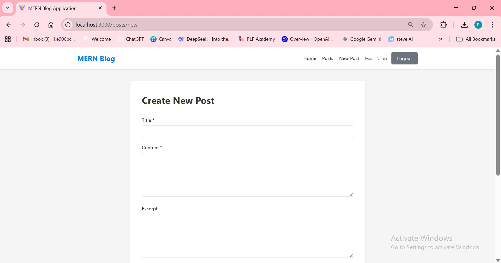

# MERN Stack Integration Assignment

A full-stack MERN (MongoDB, Express.js, React.js, Node.js) blog application that demonstrates seamless integration between front-end and back-end components.

## 🎯 Project Overview

This blog application features:
- ✅ RESTful API with Express.js and MongoDB
- ✅ React front-end with component architecture
- ✅ Full CRUD functionality for blog posts
- ✅ User authentication and authorization
- ✅ Image uploads for blog post featured images
- ✅ Comments system for blog posts
- ✅ Pagination, search, and filtering
- ✅ Responsive design with modern UI

## 📁 Project Structure

```
mern-stack-integration-mwangiucs/
├── client/                 # React front-end
│   ├── public/             # Static files
│   ├── src/                # React source code
│   │   ├── components/     # Reusable components
│   │   │   ├── Navbar.jsx
│   │   │   ├── PostCard.jsx
│   │   │   ├── Loading.jsx
│   │   │   └── Error.jsx
│   │   ├── pages/          # Page components
│   │   │   ├── Home.jsx
│   │   │   ├── Posts.jsx
│   │   │   ├── PostDetail.jsx
│   │   │   ├── PostForm.jsx
│   │   │   ├── Login.jsx
│   │   │   └── Register.jsx
│   │   ├── hooks/          # Custom React hooks
│   │   │   └── useApi.js
│   │   ├── services/       # API services
│   │   │   └── api.js
│   │   ├── context/        # React context providers
│   │   │   ├── AuthContext.jsx
│   │   │   └── PostContext.jsx
│   │   ├── App.jsx         # Main application component
│   │   ├── main.jsx        # Entry point
│   │   └── index.css       # Global styles
│   ├── index.html          # HTML template
│   ├── vite.config.js      # Vite configuration
│   └── package.json        # Client dependencies
├── server/                 # Express.js back-end
│   ├── config/             # Configuration files
│   │   └── database.js     # MongoDB connection
│   ├── controllers/        # Route controllers
│   │   ├── authController.js
│   │   ├── postController.js
│   │   └── categoryController.js
│   ├── models/             # Mongoose models
│   │   ├── User.js
│   │   ├── Post.js
│   │   └── Category.js
│   ├── routes/             # API routes
│   │   ├── auth.js
│   │   ├── posts.js
│   │   └── categories.js
│   ├── middleware/         # Custom middleware
│   │   ├── auth.js         # Authentication middleware
│   │   └── errorHandler.js # Error handling
│   ├── utils/              # Utility functions
│   │   ├── generateToken.js
│   │   └── upload.js       # File upload configuration
│   ├── uploads/            # Uploaded images (created automatically)
│   ├── server.js           # Main server file
│   └── package.json        # Server dependencies
├── README.md               # Project documentation
└── Week4-Assignment.md    # Assignment instructions
```

## 🚀 Getting Started

### Prerequisites

- Node.js (v18 or higher)
- MongoDB (local installation or MongoDB Atlas account)
- npm or yarn
- Git

### Installation

1. **Clone the repository**
   ```bash
   git clone https://github.com/PLP-MERN-Stack-Development/mern-stack-integration-mwangiucs.git
   cd mern-stack-integration-mwangiucs
   ```

2. **Install server dependencies**
   ```bash
   cd server
   npm install
   ```

3. **Install client dependencies**
   ```bash
   cd ../client
   npm install
   ```

4. **Set up environment variables**

   Create a `.env` file in the `server` directory:
   ```env
   PORT=5000
   NODE_ENV=development
   MONGODB_URI=mongodb://localhost:27017/mern-blog
   JWT_SECRET=your-super-secret-jwt-key-change-this-in-production
   JWT_EXPIRE=7d
   MAX_FILE_SIZE=5242880
   ```

   Create a `.env` file in the `client` directory:
   ```env
   VITE_API_URL=http://localhost:5000/api
   ```

5. **Start MongoDB**
   - If using local MongoDB, ensure it's running on your system
   - If using MongoDB Atlas, update `MONGODB_URI` in the server `.env` file

6. **Start the development servers**

   In the `server` directory:
   ```bash
   npm run dev
   ```

   In a new terminal, in the `client` directory:
   ```bash
   npm run dev
   ```

7. **Access the application**
   - Front-end: http://localhost:3000
   - Back-end API: http://localhost:5000

## 📚 API Documentation

### Base URL
```
http://localhost:5000/api
```

### Authentication Endpoints

#### Register User
```
POST /api/auth/register
Body: {
  "name": "John Doe",
  "email": "john@example.com",
  "password": "password123"
}
```

#### Login
```
POST /api/auth/login
Body: {
  "email": "john@example.com",
  "password": "password123"
}
```

#### Get Current User
```
GET /api/auth/me
Headers: Authorization: Bearer <token>
```

### Post Endpoints

#### Get All Posts
```
GET /api/posts?page=1&limit=10&category=<categoryId>&search=<query>
```

#### Get Single Post
```
GET /api/posts/:id
```

#### Create Post
```
POST /api/posts
Headers: Authorization: Bearer <token>
Body: FormData {
  title: string (required)
  content: string (required)
  category: ObjectId (required)
  excerpt: string (optional)
  tags: string (comma-separated, optional)
  isPublished: boolean (optional)
  featuredImage: File (optional)
}
```

#### Update Post
```
PUT /api/posts/:id
Headers: Authorization: Bearer <token>
Body: FormData (same as create)
```

#### Delete Post
```
DELETE /api/posts/:id
Headers: Authorization: Bearer <token>
```

#### Add Comment
```
POST /api/posts/:id/comments
Headers: Authorization: Bearer <token>
Body: {
  "content": "Great post!"
}
```

#### Search Posts
```
GET /api/posts/search?q=<query>
```

### Category Endpoints

#### Get All Categories
```
GET /api/categories
```

#### Get Single Category
```
GET /api/categories/:id
```

#### Create Category (Admin only)
```
POST /api/categories
Headers: Authorization: Bearer <token>
Body: {
  "name": "Technology",
  "description": "Tech-related posts"
}
```

#### Update Category (Admin only)
```
PUT /api/categories/:id
Headers: Authorization: Bearer <token>
Body: {
  "name": "Updated Name",
  "description": "Updated description"
}
```

#### Delete Category (Admin only)
```
DELETE /api/categories/:id
Headers: Authorization: Bearer <token>
```

## ✨ Features Implemented

### Core Features
- ✅ User registration and authentication
- ✅ JWT-based authentication
- ✅ Protected routes
- ✅ Full CRUD operations for blog posts
- ✅ Category management
- ✅ Image uploads for featured images
- ✅ Comments system
- ✅ Search functionality
- ✅ Category filtering
- ✅ Pagination
- ✅ Responsive design

### Advanced Features
- ✅ Optimistic UI updates
- ✅ Loading states
- ✅ Error handling
- ✅ Input validation
- ✅ View count tracking
- ✅ Post slugs
- ✅ Role-based access control (Admin/User)

## 🛠️ Technologies Used

### Back-end
- Node.js
- Express.js
- MongoDB
- Mongoose
- JWT (jsonwebtoken)
- bcryptjs
- Multer (file uploads)
- express-validator
- Helmet (security)
- express-rate-limit

### Front-end
- React 18
- React Router DOM
- Axios
- Context API (state management)
- Vite
- CSS3

## 📸 Screenshots

### Homepage


### Create Post Form


## 📝 Project Status

✅ **Completed**
- All required API endpoints
- Complete front-end implementation
- User authentication
- Image upload functionality
- Comments system
- Search and filtering
- Pagination
- Responsive UI

## 🤝 Contributing

This is an assignment project. For suggestions or issues, please open an issue on GitHub.

## 📄 License

This project is created for educational purposes as part of the PLP MERN Stack Development course.

## 👤 Author

Created as part of the Week 4 MERN Stack Integration assignment.

## 🔗 Resources

- [MongoDB Documentation](https://docs.mongodb.com/)
- [Express.js Documentation](https://expressjs.com/)
- [React Documentation](https://react.dev/)
- [Node.js Documentation](https://nodejs.org/en/docs/)
- [Mongoose Documentation](https://mongoosejs.com/)
- [Vite Documentation](https://vitejs.dev/)
